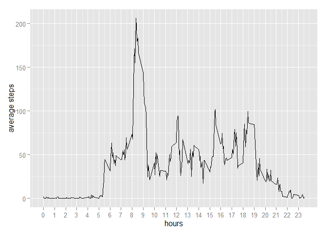

# Reproducible Research: Peer Assessment 1

first let's load the libraries we will use.  


```r
library(Hmisc) # used for imputation, should be loaded before 'psych'!
```

```
## Loading required package: grid
## Loading required package: lattice
```

```
## Warning: package 'lattice' was built under R version 3.0.3
```

```
## Loading required package: survival
## Loading required package: splines
## Loading required package: Formula
## 
## Attaching package: 'Hmisc'
## 
## The following objects are masked from 'package:base':
## 
##     format.pval, round.POSIXt, trunc.POSIXt, units
```

```r
library(ggplot2) # prettier plots
library(psych) # describe function
```

```
## 
## Attaching package: 'psych'
## 
## The following object is masked from 'package:ggplot2':
## 
##     %+%
## 
## The following object is masked from 'package:Hmisc':
## 
##     describe
```

```r
library(knitr) # tables, mainly
```

```
## Warning: package 'knitr' was built under R version 3.0.3
```


## Loading and preprocessing the data

Let's load the data. We start by 

1. unzipping it, 
2. reading it and 
3. having a quick look...


```r
unzip('activity.zip')
data <- read.csv2("activity.csv", sep=",")
kable(head(data) ,
      digits = 2 ,
      caption = "A quick preview of the dataset" ,
      align="c"
      )
```


Table: A quick preview of the dataset

 steps       date       interval 
-------  ------------  ----------
  NA      2012-10-01       0     
  NA      2012-10-01       5     
  NA      2012-10-01       10    
  NA      2012-10-01       15    
  NA      2012-10-01       20    
  NA      2012-10-01       25    

```r
kable(summary(data) ,
      digits = 2 ,
      caption = "Some statistics about our dataset")
```


Table: Some statistics about our dataset

         steps                  date            interval      
---  -----------------  -------------------  -----------------
     Min.   :  0.00     2012-10-01:  288     Min.   :   0.0   
     1st Qu.:  0.00     2012-10-02:  288     1st Qu.: 588.8   
     Median :  0.00     2012-10-03:  288     Median :1177.5   
     Mean   : 37.38     2012-10-04:  288     Mean   :1177.5   
     3rd Qu.: 12.00     2012-10-05:  288     3rd Qu.:1766.2   
     Max.   :806.00     2012-10-06:  288     Max.   :2355.0   
     NA's   :2304       (Other)   :15840     NA               


## What is mean total number of steps taken per day?

Now we focus on the steps taken each day. We do so by aggregating the steps by each unique day, using the `aggregate` function.


```r
aggregated_steps <- aggregate(data$steps ,
                              by = list(data$date) , 
                              FUN = sum)
names(aggregated_steps) <- c('date','steps') # Let's keep the naming of columns the same! 
qplot(aggregated_steps$steps)
```

```
## stat_bin: binwidth defaulted to range/30. Use 'binwidth = x' to adjust this.
```

 

The `mean` is: 


```r
mean(aggregated_steps$steps, na.rm = T)
```

```
## [1] 10766.19
```

The `median`:

```r
median(aggregated_steps$steps, na.rm = T)
```

```
## [1] 10765
```

Or to be thorough:


```r
kable(describe(aggregated_steps$steps) , 
      digits = 2 , 
      align = 'c' , 
      row.names = F , 
      caption = "Statistics about aggregated steps")
```


Table: Statistics about aggregated steps

 vars    n       mean        sd       median    trimmed       mad      min     max     range    skew    kurtosis     se   
------  ----  ----------  ---------  --------  ----------  ---------  -----  -------  -------  ------  ----------  -------
  1      53    10766.19    4269.18    10765     10940.02    3140.15    41     21194    21153    -0.3      0.59      80.55 

```r
ggplot(aggregated_steps, aes(x=steps))+geom_density(fill=1, alpha=.3)
```

```
## Warning: Removed 8 rows containing non-finite values (stat_density).
```

 


## What is the average daily activity pattern?

So what does the day look like for our fitbit/jawbone wearing subject? for that, we turn to another `aggregation`!

What we will also do is divide the intervals by *100*, giving us the hours!


```r
interval_agg <- aggregate(data$steps , 
                          by = list(data$interval) , 
                          FUN = mean , 
                          na.rm = T )

names(interval_agg)<-c('interval','steps')

interval_agg$interval <- interval_agg$interval / 100

ggplot(interval_agg, aes(interval,steps))+geom_line()+xlab("hours")+ylab("average steps")+scale_x_continuous(breaks=seq(0,23.55,1))
```

 

As you may have expected from our plot, our subject is mostly active between 8 and 9. The most active time in terms of steps (on average) is:


```r
interval_agg$interval[interval_agg$steps==max(interval_agg$steps)] # that is: 08:35
```

```
## [1] 8.35
```

## Imputing missing values

Unfortunately, there are missing values in our dataset.


```r
paste(c("There are",length(data$steps[is.na(data$steps)==T]), "missing."  ), collapse=" ")
```

```
## [1] "There are 2304 missing."
```

```r
paste(c("Which amounts to",length(data$steps[is.na(data$steps)==T])/length(data$steps)*100,'%'), collapse = " ")
```

```
## [1] "Which amounts to 13.1147540983607 %"
```


We will want to impute some missing values. There are several ways to do this, ranging from [advanced](http://www.jstatsoft.org/v45/i02/paper) to [simple](http://www.r-bloggers.com/example-2014-5-simple-mean-imputation/), but we will be [**generic**](http://svitsrv25.epfl.ch/R-doc/library/Hmisc/html/impute.html). Just think of it as an assumption that the [regression towards the mean](http://en.wikipedia.org/wiki/Regression_toward_the_mean) holds.


```r
aggregated_steps$steps.i <- impute(aggregated_steps$steps, mean, na.rm=T)
```

So how does that change our estimates?

The `mean` is: 


```r
mean(aggregated_steps$steps.i, na.rm = T)
```

```
## [1] 10766.19
```

The `median`:

```r
median(aggregated_steps$steps.i, na.rm = T)
```

```
## [1] 10766.19*
```

Or to be thorough:


```r
kable(describe(aggregated_steps$steps.i) , 
      digits = 2 , 
      align = 'c' , 
      row.names = F , 
      caption = "Statistics about aggregated steps")
```


Table: Statistics about aggregated steps

 vars    n       mean        sd        median     trimmed      mad      min     max     range    skew     kurtosis     se   
------  ----  ----------  ---------  ----------  ---------  ---------  -----  -------  -------  -------  ----------  -------
  1      61    10766.19    3974.39    10766.19    10947.4    2854.28    41     21194    21153    -0.32      1.15      65.15 

```r
ggplot(aggregated_steps, aes(x=steps.i))+geom_density(fill=1, alpha=.3)
```

```
## Don't know how to automatically pick scale for object of type impute. Defaulting to continuous
```

 


## Are there differences in activity patterns between weekdays and weekends?

First, let's look at the getting the weekdays.


```r
data$weekdays <- weekdays(as.Date(data$date)) # sorry if it's Dutch on you machine... 
```

So, now we aggregate and ecludiate!


```r
weekday_agg_mean <- aggregate(data$steps , by = list(data$weekdays), FUN = mean, na.rm=T)
weekday_agg_sd <- aggregate(data$steps , by = list(data$weekdays) , FUN = sd, na.rm=T)
both_weekday <- merge(weekday_agg_mean, weekday_agg_sd, by = "Group.1")

names(both_weekday)<-c("weekday","mean","st.dev")
both_weekday$weekday<-factor(both_weekday$weekday, levels = c("maandag", "dinsdag","woensdag","donderdag","vrijdag","zaterdag","zondag"))
summary(both_weekday)
```

```
##       weekday       mean           st.dev      
##  maandag  :1   Min.   :28.52   Min.   : 99.22  
##  dinsdag  :1   1st Qu.:32.85   1st Qu.:104.31  
##  woensdag :1   Median :40.94   Median :114.85  
##  donderdag:1   Mean   :37.75   Mean   :112.06  
##  vrijdag  :1   3rd Qu.:42.77   3rd Qu.:120.08  
##  zaterdag :1   Max.   :43.53   Max.   :121.61  
##  zondag   :1
```

We can now look at the mean number of steps each day


```r
ggplot(both_weekday, aes(x = weekday, y = mean, fill=weekday))+geom_bar(stat="identity")
```

 

And the standard deviation (which tells us something about the stress levels of our subject).


```r
ggplot(both_weekday, aes(x=weekday, fill=weekday, y=st.dev))+geom_bar(stat="identity")
```

 

Finally, we combine them into two sets and aggregate them by minute. This shows us that generally, during the week steps are limited to the morning rush to work (?) with small spurt during the day. By contrast, the weekend shos activity throughout the day (even before 12:00!) and up to around 24:00.


```r
# split the data by the working-week and weekend
week <- data[data$weekday %in% c("maandag","dinsdag","woensdag","donderdag","vrijdag"),]
weekend <- data[!data$weekday %in% c("maandag","dinsdag","woensdag","donderdag","vrijdag"),]
# Aggregate each dataset by interval
weekint <- aggregate(week$steps, by = list(week$interval), FUN = mean, na.rm = T)
weekendint <- aggregate(weekend$steps, by = list(weekend$interval), FUN = mean, na.rm = T)
# Add distinguishing feature
weekint$week<- "Week"
weekendint$week<- "Weekend"
all <- rbind(weekint,weekendint)
names(all)<-c("interval","steps","week")
all$interval <- all$interval / 100
# Plot the results
ggplot(all,aes(interval,steps,color=factor(week)))+geom_step()+facet_wrap(~week,nrow=2)
```

 

